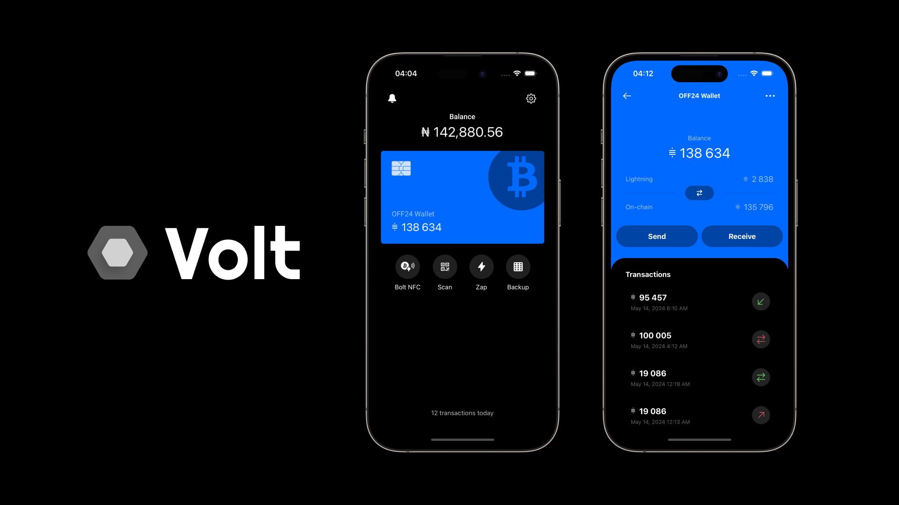
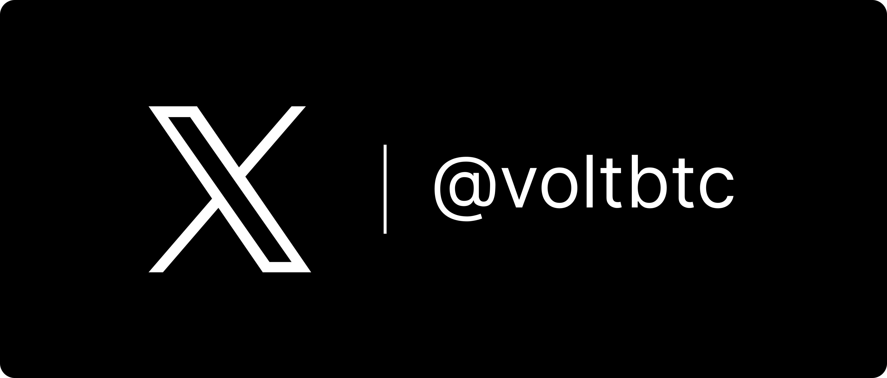

# Volt

[](https://github.com/prettier/prettier)


**:warning: Warning:** Volt is still in Beta, and very unstable, please do not use it for large amounts of Bitcoin or amounts you do not want to lose.

A modern descriptor-based Financial Freedom Bitcoin Wallet aimed at restoring sovereignty to Global Bitcoiners.

> What are descriptors? [Read more](https://github.com/bitcoin/bitcoin/blob/master/doc/descriptors.md).



# Features

- Descriptor-based HD wallet (`wpkh(KEY)`, `pkh(KEY)`, `sh(wpkh(KEY))`, `tr(KEY)`)
- Watch Only support
- Partially Signed Bitcoin Transactions (PSBTs) and Fee Bumping (RBF)
- Lightning Network support (BOLT11 & LNURL)
- Internal Wallet Lightning Swaps (Onchain ↔️ Lightning) (Broken, will be fixed in v0.6 release)
- Multi-lingual (English & Arabic)

## Official Socials

[](https://x.com/voltbtc)
[](https://primal.net/p/npub1n3dc6uzctzdpvcsywpphhkhzwnmljhu45lnpkrr30s300fr2yeyq8ed2q6)

## Download Beta

**:warning: Warning:** Volt is still in Beta, do not use it for large amounts of Bitcoin.

### Android

- Android APK coming soon.

### IOS

- IOS Beta Test flight coming soon.

## Supported BIPs

- [BIP21](https://github.com/bitcoin/bips/blob/master/bip-0021.mediawiki) URI Scheme
- [BIP32](https://github.com/bitcoin/bips/blob/master/bip-0032.mediawiki) Hierarchical Deterministic Wallets
- [BIP39](https://github.com/bitcoin/bips/blob/master/bip-0039.mediawiki) Mnemonic code for generating deterministic keys
- [BIP44](https://github.com/bitcoin/bips/blob/master/bip-0044.mediawiki) Multi-Account Hierarchy for Deterministic Wallets
- [BIP49](https://github.com/bitcoin/bips/blob/master/bip-0049.mediawiki) Derivation scheme for P2WPKH-nested-in-P2SH based accounts
- [BIP70](https://github.com/bitcoin/bips/blob/master/bip-0070.mediawiki) Payment Protocol
- [BIP84](https://github.com/bitcoin/bips/blob/master/bip-0084.mediawiki) Derivation scheme for P2WPKH based accounts
- [BIP86](https://github.com/bitcoin/bips/blob/master/bip-0086.mediawiki) Derivation scheme for PTR based accounts
- [BIP173](https://github.com/bitcoin/bips/blob/master/bip-0173.mediawiki) Base32 address format for native v0-16 witness outputs
- [BIP174](https://github.com/bitcoin/bips/blob/master/bip-0174.mediawiki) Partially Signed Bitcoin Transactions

## Supported Bitcoin Tech

- [Bitcoin Development Kit (BDK)](https://github.com/bitcoindevkit)
- [Breez SDK](https://github.com/breez/breez-sdk)

### Lightning Implementation Overview (Spark)


# Translation

For details on contributing to the app translation, please see the [translation guide](./CONTRIBUTING.md#translation)

# Build

> Note: Please ensure the version of Node and NPM you are using are >= the minimum LTS Node and NPM versions specified in the package.json file. The recommended Node and NPM versions are LTS versions (i.e. even-numbered releases). Run `node --version && npm --version` to get the versions of Node and NPM on your system if unsure.

Clone the repo locally and install the required npm dependencies:

```sh
$ git clone https://github.com/Zero-1729/volt
cd volt
yarn install
```

To run the wallet locally on, and build for, Android or IOS you'll need [Android Studio](https://developer.android.com/studio/) and [Xcode](https://developer.apple.com/xcode/resources/) installed, respectively. 

### Setup Environment file

Create a copy of the `env.example`

```sh
cp env.example .env
```

This command creates a `.env` file in the project root `volt/`. Then fill it with the appropriate info.

## Development

To run the wallet locally on your system, run the following in the project root (`volt/`):

> This will start the Metro Bundler, which is the tool responsible for bundling the app's JavaScript code and assets into a single file that can be run on the device.

```sh
$ yarn run start
```

### Note on Tailwind

Due to the way Tailwind works, you'll need to run the following command to build the Tailwind CSS file:

> This builds the Tailwind styles in watch mode. You'll need to run this command in a separate terminal window to keep the Tailwind styles updated before running the app.

```sh
$ yarn run dev:tailwind
```

### Android
 
```sh
# Using npm
npm run android
 
# OR using Yarn
yarn android
```

#### Running on Android (Virtual) Device

- Download and run the latest (stable) version of Android Studio.
- Launch Android Studio, and Open the project's android folder (`volt/android`).
- Open the `build.gradle` file in the current folder (`volt/android`), it'll take some time for Android Studio to set up.
- Navigate to `AVD Manager` under the `Tools` sections of the menu, and click "*Create Virtual Device...*" to create a virtual device.
- Launch the newly created virtual device by clicking the `Play` in the `Actions` section of the menu.
 
### iOS
 
For iOS, remember to install CocoaPods dependencies (this only needs to be run on first clone or after updating native deps).
 
The first time you create a new project, run the Ruby bundler to install CocoaPods itself:
 
```sh
bundle install
```
 
Then, and every time you update your native dependencies, run:
 
```sh
bundle exec pod install
```
 
For more information, please visit [CocoaPods Getting Started guide](https://guides.cocoapods.org/using/getting-started.html).
 
```sh
# Using npm
npm run ios
 
# OR using Yarn
yarn ios
```
 
If everything is set up correctly, you should see your new app running in the Android Emulator, iOS Simulator, or your connected device.

This is one way to run your app — you can also build it directly from Android Studio or Xcode.


# Responsible Disclosure

Email `Zero-1729@protonmail.com` with the title "`volt: bug/vulnerability report`" to disclose any critical bugs or vulnerabilities.

---

MIT &copy; Zero-1729
